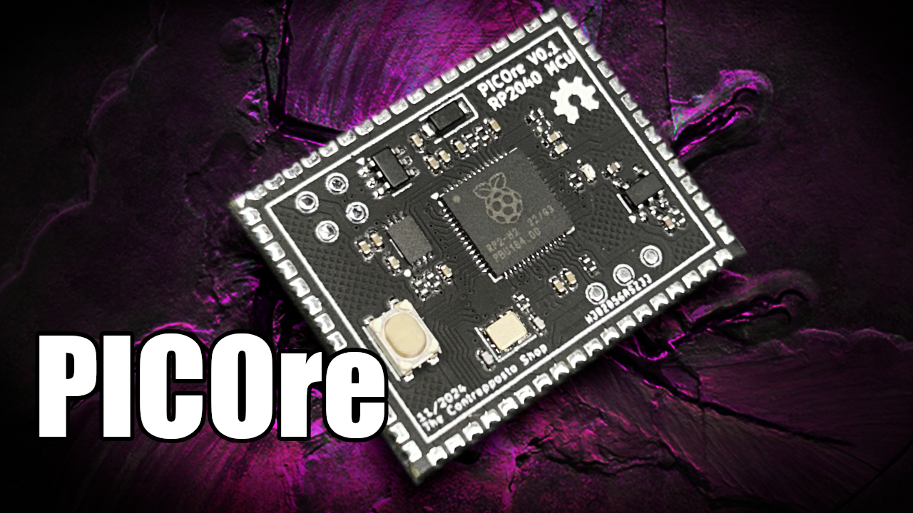

# PICOre 
The PICOre project consist of an ecosystem with stamp modules all pin to pin compatible.
This project and product will give you the opportunity to save you time in PCB design and assembly.
No need to copy and paste parts of previous design just to have the microcontroller part right.
Just drop the picore into your design and that it !

- The PICOre has the necessary USB protections so you will just need to put a USB connector on your project if you wish with differential trace for D+ and D-.
- The GND and AGND are both connected on the PICOre module using star grounding technic so if you need it on your PCB they can stay completely separated.
- The Analog Vref is floating so if you need it you have the choice to connect it with the internal LDO or hook your own vref chip on your design for better result.

# RP2040 version
The RP2040 version has all the 30 standard GPIOs you will find on a standard pico. Don't forget to follow the GPIO numbers because all of the others will are not used.

# How to use

The files you will need if you want to use the PICOre (of any version) into your PCB project is in the **Kicad_Lib** folder. Make sure to use and connect pins that are available and not any of them.
For exemple the RP2040 version has 30 GPIOs so all the other will not be connected.

There is 3 footprints you can choose. Use the **THT** version if you want to have easy access to the USB and SWD pin under you PCB and use the **SMD** version if you want BGA style solder joints.
The **PCB** footprint is for those who wants to create their owm pcb version for other MCU with on the same ecosystem.

Find us on Discord ! 
